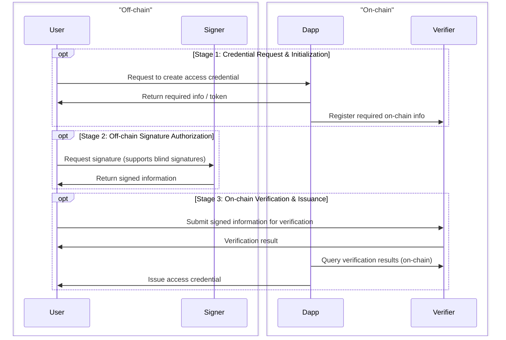

# Overview

This start-up project is aiming to provide a robust, privacy-preserving Decentralized Identity (DID) system. The core workflow, encompassing off-chain signing and on-chain verification, is illustrated below:

## Core Features & Mechanisms

### 1. Signature & Privacy Preservation
* **Flexible Signer Roles**: The Signer acts as a trusted third party to verify user identities off-chain. Leveraging the **BBS+ signature** scheme, the system naturally supports multi-party configurations. Users can obtain signatures from multiple Signers and seamlessly aggregate them prior to on-chain submission.
* **Blind Signatures**: By supporting blind signatures, the system ensures that Signers remain entirely oblivious to the specific data the user submits on-chain. This effectively decouples off-chain identities from on-chain activities, maximizing user privacy.

### 2. Application Layer Integration
* **Versatile Credential Issuance**: Dapps can directly query on-chain verification results to issue access credentials. These credentials are highly flexible and can be instantiated as Tokens, NFTs, or any other verifiable format supported by the target Dapp.

## Future Enhancements (Under Development)

We are actively evaluating the following schemes to further bolster security and operational efficiency:

* **Nullifiers & Expiry Controls**: A unique Nullifier is generated for each signed payload. The on-chain Verifier validates these nullifiers to prevent double-spending attacks. Furthermore, the system supports time-bound validity (via timestamps or block heights), enforcing periodic credential renewals.
* **Zero-Knowledge (ZK) Proof Integration**: Implementing ZK proofs to verify the ownership of signed payloads. This enables users to prove possession of valid signatures without revealing the plaintext data to the Verifier, which also has the potential to significantly reduce on-chain verification gas costs.
* **Controlled Revocation (Trapdoor) Mechanism**: Designing a secure mechanism that allows Signers to revoke credentials in response to compromised security or regulatory compliance. To prevent centralization and abuse of power, this process will enforce strict cryptographic safeguards—such as requiring the Signer to transparently publish a revocation proof or sacrifice specific cryptographic assets—ensuring all revocation actions are completely transparent and publicly auditable.

## Current Progress

- [x] **BBS+ Signature Scheme**: Fully implemented, including support for blind signatures.
- [x] **Smart Contracts for Signation Verification**: On-chain verification (Verifier) draft contracts have been developed.
